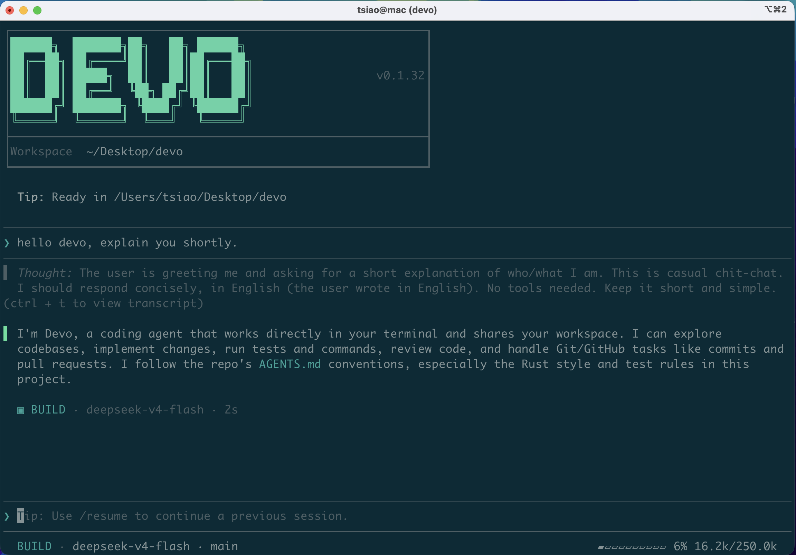

<div align="center">


</div>

<div align="center">

**Devo is an open-source coding agent with a Desktop app, terminal TUI/CLI, and model-neutral Rust runtime for private, enterprise, and OpenAI-compatible model environments. Connect DeepSeek, Qwen, Kimi, Anthropic-compatible APIs, local gateways, or your own model endpoint.**

[](https://github.com/7df-lab/devo/stargazers)
[](https://www.rust-lang.org/)
[](./LICENSE)
[](https://github.com/7df-lab/devo/pulls)
[](https://github.com/7df-lab/devo/actions)
[](https://github.com/7df-lab/devo/releases)
[](https://aur.archlinux.org/packages/devo-bin/)

[English](./README.md) | [简体中文](./README.zh-Hans.md) | [繁體中文](./README.zh-Hant.md) | [日本語](./README.ja.md) | [Русский](./README.ru.md)

[Why Devo](#why-devo) · [Screenshots](#screenshots) · [Features](#features) · [Tested Models](#tested-models) · [Tested Platforms](#tested-platforms) · [Install](#installation) · [Quick Start](#quick-start) · [Docs](#docs)

</div>

---

## Screenshots

<p align="center">
  
</p>

<p align="center">
  
</p>

## Why Devo

Devo is for teams that need a coding agent outside a single hosted model
ecosystem. It keeps the desktop experience, terminal workflow, model choice,
runtime behavior, and workspace execution under your control.

- **Bring your own model** - Connect OpenAI-compatible Chat Completions,
  OpenAI-compatible Responses, Anthropic Messages, DeepSeek, Qwen, Kimi, or
  private model gateways through provider/model Connections.
- **Works in private and intranet environments** - Run a single local Rust
  binary, support offline installation paths, and point Devo at internal
  endpoints without depending on a hosted agent service.
- **One agent across Desktop and terminal** - Use the Desktop app for visual
  onboarding and daily coding, or the CLI/TUI for terminal-native automation,
  remote shells, and scriptable workflows.
- **Built for agent runtime extensibility** - MCP servers, reusable skills,
  auditable sessions, permissions, and multi-agent flows are runtime features
  rather than one-off prompts.

## Features

- **Model-neutral provider runtime** - Use provider/model Connections for
  OpenAI-compatible, Anthropic-compatible, DeepSeek, Qwen, Kimi, GLM, MiniMax,
  Xiaomi MiMo, OpenRouter, or local endpoints.
- **MCP support** - Connect external tools and context through
  [Model Context Protocol](https://modelcontextprotocol.io/) servers. Add and
  manage servers from the CLI with `devo mcp add|list|enable|disable|remove`
  (see [Configuration](./docs/configuration.md#mcp-servers)).
- **Skill support** - Package repeatable workflows, instructions, scripts, and
  references as reusable [Agent Skills](https://agentskills.io/).
- **Long-running task support** - Let Devo manage context automatically across
  multi-turn work instead of losing the thread as tasks grow.
- **Multi-agent support** - Split work across specialized agents while keeping
  coordination visible in the session.
- **Plan Mode** - Break larger tasks into clear multi-step plans before
  implementation starts.
- **Parallel tool calls** - Run multiple independent tools in parallel so
  models spend less time waiting and more time making progress.
- **Permissioned tool execution** - Review sensitive tool calls before they
  touch your workspace.
- **Auditable sessions** - Keep model output, tool calls, approvals, token
  usage, and session history inspectable and resumable.
- **Cost and context visibility** - Show input/output tokens, cached tokens, and
  context-window usage where providers expose them.
- **Lightweight Rust runtime** - Built in Rust with low memory overhead and a
  compact local runtime.
- **Built-in semantic code search (MCP)** - Optional bundled MCP server
  (`code_search` / `devo-code-search-mcp`), **disabled by default**. Runs a
  local CPU code-embedding model and combines dense retrieval with BM25 keyword
  matching to reduce code-search context versus grep/find-only agents. Enable
  with `devo mcp enable code_search` or TUI `/mcps`.

## Tested Models

<p>
  
  
  
  
  
</p>

Devo's built-in model catalog includes tested model definitions for Qwen, Kimi,
MiniMax, GLM, and DeepSeek. Provider endpoints remain configurable through
provider/model Connections.

## Tested Platforms

<p>
  
  
  
</p>

Devo has been tested on macOS, Linux, Windows, and Kylin OS.

### For Chinese Enterprise Users

<p>
  
  
</p>

Kylin OS coverage is called out because domestic operating systems are often
part of real deployment requirements in Chinese enterprise environments.
HarmonyOS support is on the roadmap; contributors with HarmonyOS devices are
welcome to build, test, and publish releases for that platform.

## Installation

Devo can be installed in two forms. Pick the Desktop app for a graphical coding
agent workspace, the terminal-native TUI/CLI for shell-first development, or
install both on the same machine.

### Option 1: Desktop App

Start here if you want the graphical Devo experience. Download the latest Devo
Desktop package from [GitHub Releases](https://github.com/7df-lab/devo/releases/latest),
then choose the asset that matches your operating system and architecture:

- **macOS** - download the `devo-desktop-...-mac-...` `.dmg` or `.zip` asset.
- **Windows** - download the `devo-desktop-...-windows-...` `.exe` asset.
- **Linux** - download the `devo-desktop-...-linux-...` `.AppImage`, `.deb`, or
  `.rpm` asset.

**If macOS reports that `Devo.app` is damaged and cannot be opened, this is
expected.** Current macOS Desktop builds are unsigned, so after installing,
run the following command so macOS can launch the app:

```bash
sudo xattr -dr com.apple.quarantine /Applications/Devo.app
```

### Option 2: TUI / CLI

Install the terminal-native `devo` command if you prefer the TUI, want shell
automation, or want to use Devo alongside the Desktop app.

Linux / macOS:

```bash
curl -fsSL https://raw.githubusercontent.com/7df-lab/devo/main/install.sh | sh
```

Windows:

```powershell
irm 'https://raw.githubusercontent.com/7df-lab/devo/main/install.ps1' | iex
```

The online installer places `devo` under the Devo home directory, installs the
`rg` sidecar used for fast repository search, and supports optional setup for
the local model used by `code_search`.

<details>
<summary>Optional: preinstall the local <code>code_search</code> model</summary>

Use this only if you want the Hugging Face model downloaded during installation.

Linux / macOS:

```bash
curl -fsSL https://raw.githubusercontent.com/7df-lab/devo/main/install.sh | sh -s -- --install-code-search-model
```

Windows:

```powershell
$env:DEVO_INSTALL_CODE_SEARCH_MODEL = "1"; irm 'https://raw.githubusercontent.com/7df-lab/devo/main/install.ps1' | iex
```

</details>

Upgrade an existing installation to the latest release:

```bash
devo upgrade
```

The upgrade command runs the same platform installer, and the installer prints
the version transition, for example `Version: v0.1.12 -> v0.1.15`.

For air-gapped or intranet installs, see
[Offline Installation](./docs/offline-installation.md).

## Quick Start

Configure a provider, open a repository, and start the TUI:

```bash
cd /path/to/your/repo
devo onboard
```

Useful commands:

```bash
devo                         # start the interactive TUI in the current repo
devo resume <session-id>
```

## Configuration

`devo onboard` is the recommended setup path. It writes provider Connections
and model directories to `providers.json` and stores your API key in
user-scoped `auth.json`.

To bring your own key with a custom model manually:

1. Define a `provider.<id>.models.<model-id>` entry in `providers.json` and set
   the active model as `provider/model`.
2. Put the secret in `DEVO_HOME/auth.json` and reference that credential id from
   `provider.<id>.credential` — never put the API key itself in `providers.json`.
3. Set `wire_api` to match the endpoint protocol:
   `openai_chat_completions`, `openai_responses`, or `anthropic_messages`.

Full worked example (custom model parameters + API key) and protocol details:
[Configuration](./docs/configuration.md#bring-your-own-api-key).

## Slow Providers

Provider responses are not subject to an application-level response timeout, so
local models may take as long as necessary to load or generate output. Provider
connections still have an internal connection-establishment deadline, and every
request can be cancelled by the user.

## Docs

- [Offline Installation](./docs/offline-installation.md)
- [Configuration](./docs/configuration.md)

## FAQ

### What is the project status?

Devo is pre-1.0 and actively developed. It is ready for local evaluation,
experiments, and contributor use; public APIs and configuration may still
change.

### What models are supported?

Built-in model metadata currently covers Qwen, Kimi, MiniMax, GLM, and DeepSeek
families. Any model endpoint that supports OpenAI-compatible Chat Completions,
OpenAI-compatible Responses, or the Anthropic Messages API can be connected through
provider/model Connections.

### How do I bring my own API key?

Use `devo onboard`, or manually define a custom provider/model in
`providers.json`, store the key in user-scoped `auth.json`, and set
`wire_api` to `openai_chat_completions`, `openai_responses`, or
`anthropic_messages`. See
[Configuration](./docs/configuration.md#bring-your-own-api-key).

### Should I use the Desktop app or the TUI/CLI?

Use the Desktop app when you want visual onboarding, session browsing, and a
graphical coding workspace. Use the TUI/CLI when you want terminal-native
automation, remote shell workflows, or a coding agent that stays inside your
existing command-line setup. Both surfaces target the same local Devo runtime.

## Contributing

Contributions are welcome while the project is still early:

- Architecture feedback on the client/server runtime, provider layer, safety
  model, and TUI.
- Documentation and translations.
- Provider, model, and wire API coverage.
- Focused fixes with validation commands and regression tests.

Open an issue or pull request to discuss changes.

## License

This project is licensed under the [MIT License](./LICENSE).

---

**If you find Devo useful, please consider giving it a star.**
